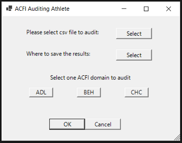

# ACFI Audit Athlete

## What is it?
This auditing tool does a quick sweep of progress notes and only keeps those that may be relevant to the selected ACFI domain.
 A second set of ACFI eyeballs to audit and catch any missed changes.

## Why?
Auditing progress notes for changes in resident care needs can be very time consuming with reading notes that are not relevant.
  This tool filters the progress notes by the selected ACFI domain to identify changes in care needs earlier, audit more effeiciently and increase funding accordingly.

## Language:
Written in PowerShell using the .Net framework and WinForms GUI. Requires no external downloads to run.

## How to use it:

- Export from your Resident Management Software the progress notes you wish to review into a csv file. 
- Click on the first ‘select’ button and select the csv file of progress notes you wish to audit.
- Click on the second ‘select’ button to choose where you would like the save the results from this audit.
- Select which domain you would like to filter the results for.
- Click ‘OK’ and the program will immediately run, opening up your newly created csv report in Excel.

## Full Instructions:
Full step by step instructions with images can be found on my main website [HERE](https://www.zoedekraker.com/projects/acfiauditingathlete)

