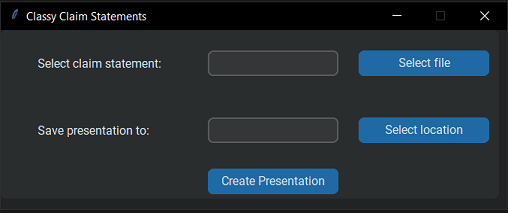
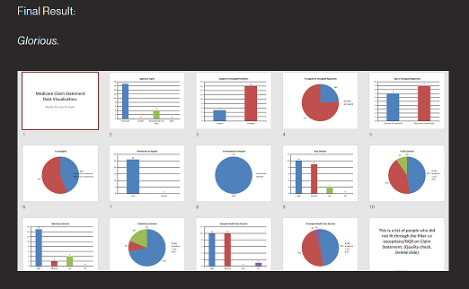

# Classy Claim Statements

## What is it?
A tool that converts a Medicare Claim Statement csv file into a 15 slide PowerPoint presentation including charts.

## Why?
Data visualisation helps to encourage data driven decisions for better operational performance and care. 
 
Plus, who doesn't like some nice charts in a presentation done for you...? Just gotta style it to suit and impress people.

## Language:
Written in Python 3.10 
 (not very OOP, quite procedural  & slightly messy. An early coding project that does work though)

2 external libraries used: 
  - Custom Tkinter (GUI) https://github.com/TomSchimansky/CustomTkinter 
  - Python PPTX (PowerPoint) https://github.com/scanny/python-pptx 

## How to use it:

- Download your Claim Statement from Medicare in a csv file format. Select the file.
- Select where you would like to save your new PowerPoint Presentation and name the new file.
- Click the 'Create Presentation' button and your presentation will be created and opened for you to style. 

## Result:

## Full Instructions:
Full step by step instructions with images can be found on my main website [HERE](https://www.zoedekraker.com/projects/classyclaimstatements)

