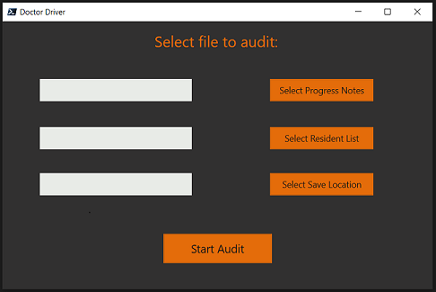

# Doctor Driver

## What is it?
A tool to help GP’s stay on track by knowing at a glance when the last GP progress note was completed for your residents. 

## Why?
Keeping track that a large number of residents are seeing their GP frequently can be difficult as GP's often attend facilities out of hours or don't communicate with care staff. Occasionally, situations can happen where residents have not seen a GP in a long time - this tool helps to monitor that. It can also be extended to automatically send alerts after a certain time since the last visit or set up to run automatically and reports emailed. (Talk to your I.T person to set that up)

## Language:
Written in PowerShell using the .Net framework and WPF GUI. Requires no external downloads to run.

## How to use it:

- Export from your resident management software the progress notes that you wish to audit in a csv file format. 
- To use the program simply click the ‘Select Progress Notes’ button to select the progress note file you wish to audit.
- Click the ‘Select Resident List’ button to select the csv file with resident names you wish to check for. 
  (Column headers should be FirstName, LastName.)
- Click ‘Select Save Location’ to select where you would like the save the results to.
- Simply click ‘Start Audit’ to start the audit.

## Full Instructions:
Full step by step instructions with images can be found on my main website [HERE](https://www.zoedekraker.com/projects/doctordriver)
