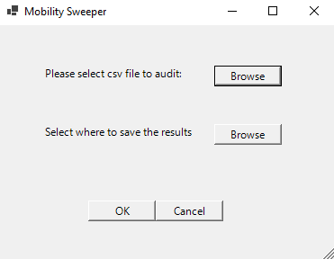

# Mobility Sweeper

## What is it?
A tool to help ACFI/AN-ACC and Quality staff audit progress notes for changes in mobility and unreported falls/incidents

## Why?
Auditing progress notes for changes to mobility can be time consuming as most changes are handed over. This tool helps to highlight those situations where documented changes may not have been reported or handed over. A second set of eyes. 

## Language:
Written in PowerShell using the .Net framework and WinForms GUI. Requires no external downloads to run.

## How to use it:

- Export from your resident management software the progress notes that you wish to audit in a csv file format. 
- To use simply select the csv file you wish to audit, where you would like to save the report and then click ‘OK’.
- A screen will pop up to show you the results which also provides extra filtering and sorting functionality.
- The result is also written to csv file for easy sharing.

## Full Instructions:
Full step by step instructions with images can be found on the main website [HERE](https://www.zoedekraker.com/projects/mobilitysweeper)

