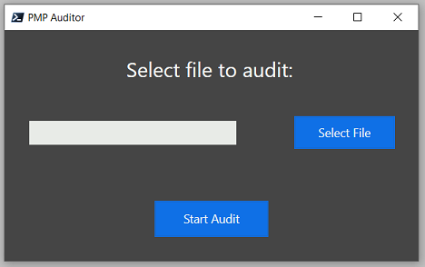

# PMP Audit Buddy

## What is it?
A tool to help ACFI staff audit CHC 12.3, 12.4a and 12.4b charting more effecintly.

## Why?
Auditing PMP charting for compliance can be time consuming and non-compliance brings the risk of ACFI downgrade at Validation and loss of funding.

## Language:
Written in PowerShell using the .Net framework and WPF GUI. Requires no external downloads to run.

## How to use it:

- Export from your resident management software the resident’s PMP charting that you wish to audit in a csv file format. 
- To use simply click the ‘Select File’ button to select the csv file you wish to audit and then click ‘Start Audit’.
- A screen will pop up to show you the results. The first column is the week number of the year(i.e there is 52 weeks a year, this is *that* week number).

- The result window also provides extra filtering and sorting functionality.

## Full Instructions:
Full step by step instructions with images can be found on the main website [HERE](https://www.zoedekraker.com/projects/pmpauditbuddy)

